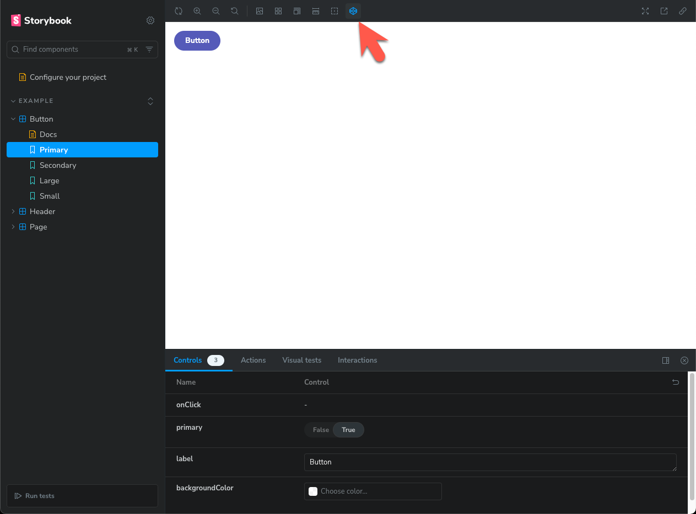
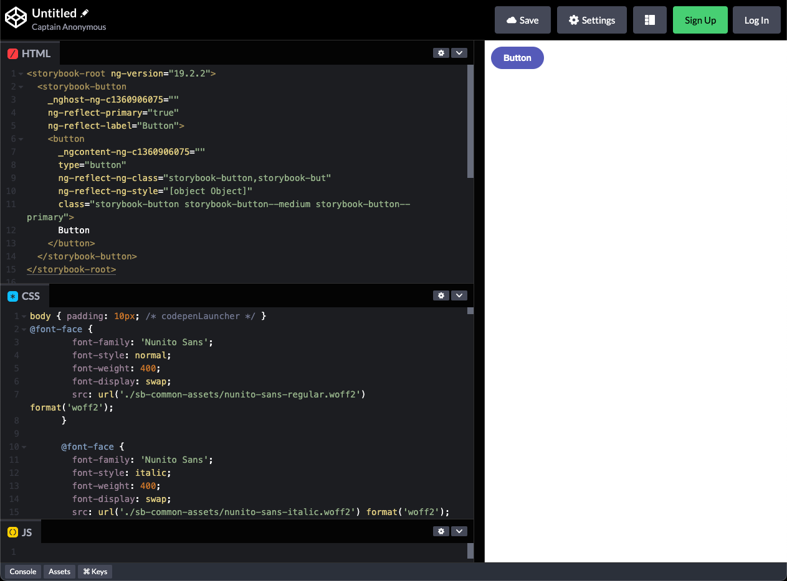

# Storybook Addon CodePen Launcher

This package is still in the alpha phase. Please submit any issues [HERE](https://github.com/robertkever/storybook-addon-codepen-launcher/issues).

This Storybook addon allows you to launch CodePen examples directly from your Storybook stories. Follow the steps below to integrate and use this addon in your project.





## Installation

First, install the addon via npm:

```bash
npm install --save-dev @rkever2/storybook-addon-codepen-launcher
```

## Register Addon

Add the addon to your Storybook configuration. Edit your `.storybook/main.js` file to include the addon:

```javascript
// Replace your-framework with the framework you are using (e.g., react-webpack5, vue3-vite)
import type { StorybookConfig } from '@storybook/your-framework';

const config: StorybookConfig = {
  // ...rest of config
  addons: [
    '@storybook/addon-essentials'
    '@rkever2/storybook-addon-codepen-launcher', // 👈 register the addon here
  ],
};

export default config;
```

## Configuration

You can configure the codepen launcher addon globally and at the story level. See [CodepenSettingsConfig.json](./src/components//codepen/CodepenSettingsConfig.json)

Below is a basic example using the most basic settings.

### Global Settings

Set global settings in your `src/preview.js` file. Any settings, whether set here or not, can be overwritten at the story level (see Story Settings below);

```javascript
// src/preview.js
const preview: Preview = {
  parameters: {
    codepenLauncher: {
      global: {
        titlePrepend: "My Project Name",
        resultsIframeBodyDefaultPadding: "10px",
        removeCommentsFromHtml: true,
      },
      options: {
        css_external:
          "https://URL_TO_MY_FRAMEWORK_STYLES",
        js_external:
          "https://URL_LINK_TO_MY_FRAMEWORK_SCRIPTS",
      },
    }
  }
};

export default preview;
```

### Story Settings

Although not neccessary, you can modify any of the codenpenLauncher settings at a story level.

```javascript
import React from "react";
import { MyComponent } from "./MyComponent";

export default {
    title: "MyComponent",
    component: MyComponent,
};

const Template = (args) => <MyComponent {...args} />;

export const Default = Template.bind({});
Default.args = {
    // component props...
    args: {
        // component args...
    },
    codepenLauncher: {
        globals: {
            // global settings...
        },
        post: {
            // post settings...
        },
        options: {
            // codepen options...
        },
    },
};
```

## Settings Explained

### All Available Settings

```javascript
  codepenLauncher: {
    global: { // global settings
        titlePrepend: "My Project", // Your project name
        titlePrependSeperator: " - ", // The seperator for new codepen name (prepends the story name)
        resultsIframeBodyDefaultPadding: "10px", // add padding to codepen (if not, it will hug the edge unless you've added CSS for that)
        removeCommentsFromHtml: false // remove comments from HTML (e.g. lit or angular auto generated)
    },

    post: { // codepen post prefill settings (see https://blog.codepen.io/documentation/prefill/)
        actionUrl: "https://codepen.io/pen/define", // url defined by codepen
        target: "_blank", // How to open the new codepen window
        inputName: "data" // input name defined by codepen
    },

    options: { // see https://blog.codepen.io/documentation/prefill/
        title: "", // codepen title (if empty will just use story name)
        description: "", // description
        private: false, // true || false - When the Pen is saved, it will save as Private if logged in user has that privledge, otherwise it will save as public
        parent: null, // // If supplied, the Pen will save as a fork of this id. Note it's not the slug, but ID. ou can find the ID of a Pen with `window.CP.pen.id` in the browser console.
        tags: [], // // an array of strings
        editors: "111", // Set which editors are open. In this example HTML open, CSS closed, JS open
        layout: "left", // top | left | right
        html: "", // codepen HTML
        html_pre_processor: "none", // "none" || "slim" || "haml" || "markdown"
        css: "", // codepen CSS
        css_pre_processor: "none", // "none" || "less" || "scss" || "sass" || "stylus"
        css_starter: "normalize", // "normalize" || "reset" || "neither"
        css_prefix: "neither", // "autoprefixer" || "prefixfree" || "neither"
        js: "", // codepen JS
        js_pre_processor: "none", // "none" || "coffeescript" || "babel" || "livescript" || "typescript"
        html_classes: "", // classes to add to HTML
        head: "", // content to add to iframes <head />
        css_external: "", // semi-colon separate multiple external CSS files
        js_external: "" // semi-colon separate multiple external JS files
    }
}
```

### Settings Requirements

As mentioned under "Global Settings", there is really only one neccessary, although not required, setting you'll want to make sure is defined, global.title. The others are neccessary based on your individual requirements either globally or at a story level.

### Setting: options.html

The HTML that's sent over to codepen will be taken from the storybook story context.canvasElement UNLESS you have set a value to the options.html such as in the case where you would like to customize the HTML at the story level. Lit, angular, and other libs sometimes drop comments in the rendered HTML. You can easily remove that by setting `global.removeCommentsFromHtml = true` (in src/preview.js for example);

### Setting: options.css

The CSS, if not defined, will just scrape the CSS in the story's rendered iframe. You can override that by setting a value to options.css. You can also add external css file (such as a global lib file) by setting options.css_external.
